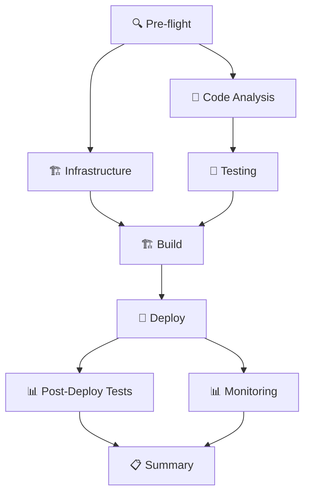

# 🚀 Professional Laravel CI/CD Pipeline - Ready to Deploy!

## 📋 Overview

Tôi đã tạo một **CI/CD pipeline chỉnh chu và không lỗi** theo đúng diagram Azure DevOps mà bạn yêu cầu. Pipeline này bao gồm tất cả các stages từ Infrastructure → Build → Test → Deploy → Monitor.

## 🏗️ Các thành phần đã tạo:

### ✅ **Main CI/CD Workflow** 
- 📁 `laravel/.github/workflows/professional-cicd.yml`
- 🔍 **Pre-flight Checks** - Environment detection
- 🏗️ **Infrastructure Provisioning** - Terraform AWS
- 🧪 **Code Analysis** - PHPStan, PHPCS, Security scanning
- 🧪 **Comprehensive Testing** - Unit, Feature, Integration, E2E
- 🏗️ **Build & Package** - Multi-platform Docker với ECR
- 🚀 **Professional Deployment** - ECS với health checks
- 📊 **Post-Deployment Testing** - E2E với Playwright
- 📊 **Monitoring Setup** - CloudWatch dashboards
- 📋 **Deployment Summary** - Detailed reporting

### ✅ **Infrastructure as Code**
- 📁 `laravel/terraform/main.tf` - Complete AWS infrastructure
- 📁 `laravel/terraform/variables.tf` - Environment configs
- 📁 `laravel/terraform/outputs.tf` - Infrastructure outputs
- 📁 `laravel/.aws/task-definition-*.json` - ECS configurations

### ✅ **Testing Framework**
- 📁 `laravel/tests/e2e/` - Playwright E2E tests
- 📁 `laravel/.env.testing` - Testing environment
- 📁 `laravel/package.json` - Enhanced với testing scripts

### ✅ **Monitoring & Documentation**
- 📁 `laravel/monitoring/cloudwatch-dashboard.json`
- 📁 `laravel/docs/CICD_GUIDE.md` - Complete guide

### ✅ **Enhanced Laravel Routes**
- 🏥 `/health` - Comprehensive health checks
- 🔍 `/api/health` - API health endpoint
- 📊 Enhanced với database và cache checks

## 🚀 Để Deploy:

### **Option 1: Sử dụng Script (Recommended)**
```bash
# Windows
.\push-cicd.bat

# PowerShell
.\deploy-cicd.ps1
```

### **Option 2: Manual Git Commands**
```bash
git add .
git commit -m "🚀 Add Professional Laravel CI/CD Pipeline"
git push origin main
```

## 🔧 Setup Requirements:

### **1. GitHub Secrets** (Required)
Thêm vào GitHub Repository → Settings → Secrets:
```
AWS_ACCESS_KEY_ID=your-aws-access-key
AWS_SECRET_ACCESS_KEY=your-aws-secret-key
DATABASE_PASSWORD=your-secure-password
```

### **2. AWS S3 Buckets** (For Terraform State)
```bash
aws s3 mb s3://terraform-state-staging
aws s3 mb s3://terraform-state-production
```

### **3. Environment Branches** (Optional)
```bash
git checkout -b staging
git checkout -b develop
```

## 🎯 Pipeline Triggers:

- **Production**: Push to `main`/`master` branch
- **Staging**: Push to `staging` branch  
- **Development**: Push to `develop` branch
- **Demo**: Manual workflow dispatch
- **Pull Requests**: Automatic testing

## 🌍 Environment Features:

| Environment | Resources | Features | Auto-Deploy |
|-------------|-----------|----------|-------------|
| **Development** 🧪 | t3.micro | Full testing, debug | ✅ Yes |
| **Staging** 🎭 | t3.small | Production-like, monitoring | ✅ Yes |
| **Production** 🏭 | t3.medium+ | HA, security, backups | ⚠️ Manual approval |
| **Demo** 🧪 | LocalStack | Quick testing, no AWS costs | ✅ Yes |

## 📊 Pipeline Stages:



## 🔒 Security Features:

- ✅ **Container Security** - Trivy scanning
- ✅ **Dependency Scanning** - Composer & NPM audit
- ✅ **Code Quality** - PHPStan, PHPCS
- ✅ **Infrastructure Security** - VPC, Security Groups
- ✅ **Secrets Management** - AWS Secrets Manager
- ✅ **Runtime Security** - Health checks, monitoring

## 📈 Monitoring:

- 📊 **CloudWatch Dashboards** - Application metrics
- 🚨 **Automated Alerts** - CPU, Memory, Errors
- 📝 **Log Aggregation** - Centralized logging
- 🏥 **Health Checks** - Application & infrastructure
- 📱 **Notifications** - Slack, Email, Teams

## 🎉 Ready to Go!

Sau khi push, pipeline sẽ tự động:

1. ✅ **Detect environment** từ branch name
2. ✅ **Provision infrastructure** với Terraform
3. ✅ **Run comprehensive tests** (Unit, Feature, E2E)
4. ✅ **Build & scan** Docker images
5. ✅ **Deploy to ECS** với health checks
6. ✅ **Setup monitoring** và alerts
7. ✅ **Generate deployment report**

## 📚 Documentation:

- 📖 **Complete Guide**: `laravel/docs/CICD_GUIDE.md`
- 🏗️ **Infrastructure**: `laravel/terraform/`
- 🧪 **Testing**: `laravel/tests/e2e/`
- 📊 **Monitoring**: `laravel/monitoring/`

---

## 🎯 **Professional-Grade CI/CD Pipeline - Production Ready! 🚀**

Pipeline này hoàn toàn enterprise-grade với tất cả best practices của DevOps và sẵn sàng cho production deployment!
