# 🚀 Professional Laravel CI/CD Pipeline Guide

## 📋 Overview

This comprehensive CI/CD pipeline provides enterprise-grade deployment automation for Laravel applications, following the Azure DevOps workflow pattern with GitHub Actions.

## 🏗️ Pipeline Architecture

```mermaid
graph TD
    A[🔍 Pre-flight Checks] --> B[🏗️ Infrastructure]
    A --> C[🧪 Code Analysis]
    C --> D[🧪 Testing]
    B --> E[🏗️ Build & Package]
    D --> E
    E --> F[🚀 Deploy]
    F --> G[📊 Post-Deploy Tests]
    F --> H[📊 Monitoring Setup]
    G --> I[📋 Summary]
    H --> I
```



## 🎯 Features

### ✅ **Infrastructure as Code**
- **Terraform** for AWS resource provisioning
- **Multi-environment** support (dev, staging, production, demo)
- **LocalStack** integration for local development
- **State management** with S3 backend

### ✅ **Comprehensive Testing**
- **Unit Tests** with PHPUnit
- **Feature Tests** for Laravel functionality
- **Integration Tests** for external services
- **E2E Tests** with Playwright
- **Code Quality** analysis with PHPStan & PHPCS
- **Security Scanning** with Trivy & Composer Audit

### ✅ **Professional Deployment**
- **Multi-stage builds** with Docker
- **Container registry** with Amazon ECR
- **Blue-green deployment** with ECS
- **Health checks** and rollback capabilities
- **Database migrations** automation

### ✅ **Monitoring & Observability**
- **CloudWatch** dashboards and alarms
- **Application Performance Monitoring**
- **Log aggregation** and analysis
- **Real-time notifications**

## 🚀 Quick Start

### 1. **Repository Setup**

```bash
# Clone and setup
git clone <your-repo>
cd laravel-app

# Install dependencies
composer install
npm install

# Setup environment
cp .env.example .env
php artisan key:generate
```

### 2. **AWS Configuration**

```bash
# Configure AWS CLI
aws configure

# Create S3 bucket for Terraform state
aws s3 mb s3://terraform-state-staging
aws s3 mb s3://terraform-state-production
```

### 3. **GitHub Secrets Setup**

Add these secrets to your GitHub repository:

```yaml
AWS_ACCESS_KEY_ID: your-aws-access-key
AWS_SECRET_ACCESS_KEY: your-aws-secret-key
DATABASE_PASSWORD: your-secure-db-password
```

### 4. **First Deployment**

```bash
# Push to trigger pipeline
git add .
git commit -m "🚀 Initial deployment"
git push origin main
```

## 🌍 Environment Strategy

### **Development** 🧪
- **Trigger**: Push to `develop` branch
- **Resources**: Minimal (t3.micro instances)
- **Features**: Full testing, debug enabled
- **Auto-deploy**: Yes

### **Staging** 🎭
- **Trigger**: Push to `staging` branch
- **Resources**: Production-like (t3.small instances)
- **Features**: Full testing, performance monitoring
- **Auto-deploy**: Yes

### **Production** 🏭
- **Trigger**: Push to `production` branch
- **Resources**: High availability (t3.medium+ instances)
- **Features**: Security hardened, monitoring, backups
- **Auto-deploy**: Manual approval required

### **Demo** 🧪
- **Trigger**: Manual workflow dispatch
- **Resources**: LocalStack simulation
- **Features**: Quick testing, no AWS costs
- **Auto-deploy**: Yes

## 🔧 Configuration

### **Terraform Variables**

```hcl
# terraform/terraform.tfvars
aws_region = "us-east-1"
environment = "staging"
database_password = "secure-password"
rds_instance_class = "db.t3.small"
ecs_desired_count = 2
```

### **Environment Variables**

```bash
# .env.staging
APP_ENV=staging
APP_DEBUG=false
DB_HOST=your-rds-endpoint
CACHE_DRIVER=redis
QUEUE_CONNECTION=sqs
```

## 🧪 Testing Strategy

### **Unit Tests**
```bash
# Run unit tests
php artisan test --testsuite=Unit --coverage

# With specific filters
php artisan test --filter=UserTest
```

### **Feature Tests**
```bash
# Run feature tests
php artisan test --testsuite=Feature

# With database refresh
php artisan test --testsuite=Feature --env=testing
```

### **E2E Tests**
```bash
# Run all E2E tests
npm run test:e2e

# Run with UI
npm run test:e2e:ui

# Debug mode
npm run test:e2e:debug
```

## 🚀 Deployment Process

### **Automatic Deployment**

1. **Code Push** → Triggers pipeline
2. **Pre-flight Checks** → Environment detection
3. **Infrastructure** → Terraform provisioning
4. **Code Analysis** → Quality & security checks
5. **Testing** → Comprehensive test suite
6. **Build** → Docker image creation
7. **Deploy** → ECS service update
8. **Verification** → Health checks & E2E tests
9. **Monitoring** → Dashboard & alerts setup

### **Manual Deployment**

```bash
# Trigger manual deployment
gh workflow run "Professional Laravel CI/CD Pipeline" \
  --field environment=production \
  --field skip_tests=false
```

## 📊 Monitoring

### **CloudWatch Dashboards**
- **Application Metrics**: CPU, Memory, Response times
- **Database Metrics**: Connections, Query performance
- **Infrastructure Metrics**: Load balancer, Auto-scaling

### **Alerts Configuration**
- **High CPU Usage** (>80% for 5 minutes)
- **High Error Rate** (>5% for 2 minutes)
- **Database Connection Issues**
- **Application Health Check Failures**

### **Log Analysis**
```bash
# View application logs
aws logs tail /ecs/laravel-app-staging --follow

# Search for errors
aws logs filter-log-events \
  --log-group-name /ecs/laravel-app-staging \
  --filter-pattern "ERROR"
```

## 🔒 Security

### **Container Security**
- **Base image scanning** with Trivy
- **Dependency vulnerability** checks
- **Runtime security** monitoring
- **Secrets management** with AWS Secrets Manager

### **Infrastructure Security**
- **VPC isolation** with private subnets
- **Security groups** with minimal access
- **IAM roles** with least privilege
- **Encryption** at rest and in transit

### **Application Security**
- **CSRF protection** enabled
- **XSS protection** headers
- **SQL injection** prevention
- **Input validation** and sanitization

## 🛠️ Troubleshooting

### **Common Issues**

#### **Deployment Failures**
```bash
# Check ECS service status
aws ecs describe-services \
  --cluster laravel-cluster-staging \
  --services laravel-service-staging

# View task logs
aws logs tail /ecs/laravel-app-staging --follow
```

#### **Database Connection Issues**
```bash
# Test database connectivity
php artisan tinker
>>> DB::connection()->getPdo();
```

#### **Performance Issues**
```bash
# Check application metrics
aws cloudwatch get-metric-statistics \
  --namespace AWS/ECS \
  --metric-name CPUUtilization \
  --dimensions Name=ServiceName,Value=laravel-service-staging
```

### **Rollback Procedures**

#### **Application Rollback**
```bash
# Rollback to previous task definition
aws ecs update-service \
  --cluster laravel-cluster-staging \
  --service laravel-service-staging \
  --task-definition laravel-app-staging:PREVIOUS_REVISION
```

#### **Infrastructure Rollback**
```bash
# Terraform rollback
cd terraform
terraform plan -destroy
terraform apply -auto-approve
```

## 📚 Best Practices

### **Development Workflow**
1. **Feature branches** for new development
2. **Pull requests** with required reviews
3. **Automated testing** before merge
4. **Staging deployment** for validation
5. **Production deployment** with approval

### **Security Practices**
1. **Regular dependency updates**
2. **Security scanning** in pipeline
3. **Secrets rotation** schedule
4. **Access logging** and monitoring
5. **Incident response** procedures

### **Performance Optimization**
1. **Database query optimization**
2. **Caching strategy** implementation
3. **CDN** for static assets
4. **Auto-scaling** configuration
5. **Performance monitoring**

## 🆘 Support

### **Documentation**
- [Laravel Documentation](https://laravel.com/docs)
- [AWS ECS Guide](https://docs.aws.amazon.com/ecs/)
- [Terraform AWS Provider](https://registry.terraform.io/providers/hashicorp/aws/)

### **Monitoring Dashboards**
- **Application**: CloudWatch Dashboard
- **Infrastructure**: AWS Console
- **Logs**: CloudWatch Logs Insights

### **Emergency Contacts**
- **DevOps Team**: devops@company.com
- **On-call Engineer**: +1-xxx-xxx-xxxx
- **Incident Management**: incident@company.com

---

## 🎉 Conclusion

This professional CI/CD pipeline provides enterprise-grade automation for Laravel applications with comprehensive testing, security, monitoring, and deployment capabilities. The pipeline follows industry best practices and can be customized for specific organizational needs.

**Happy Deploying! 🚀**
